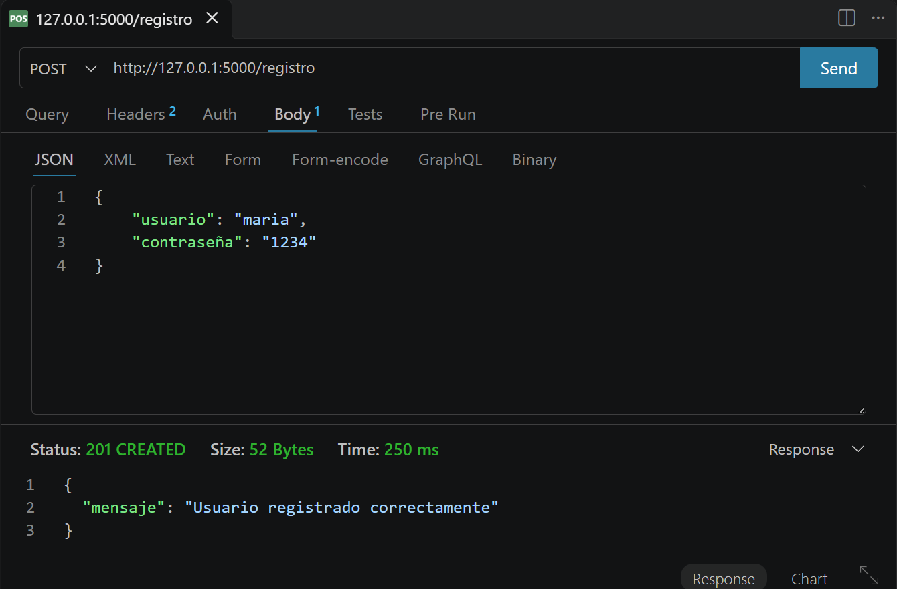
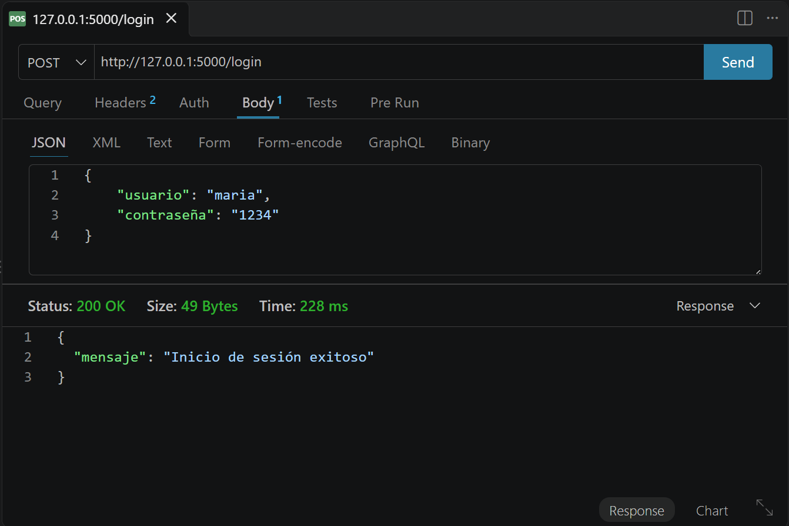
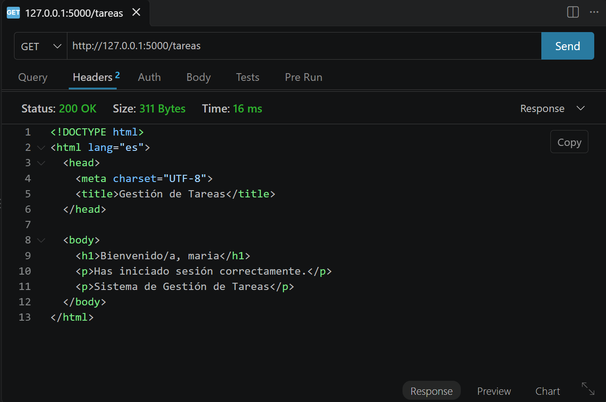
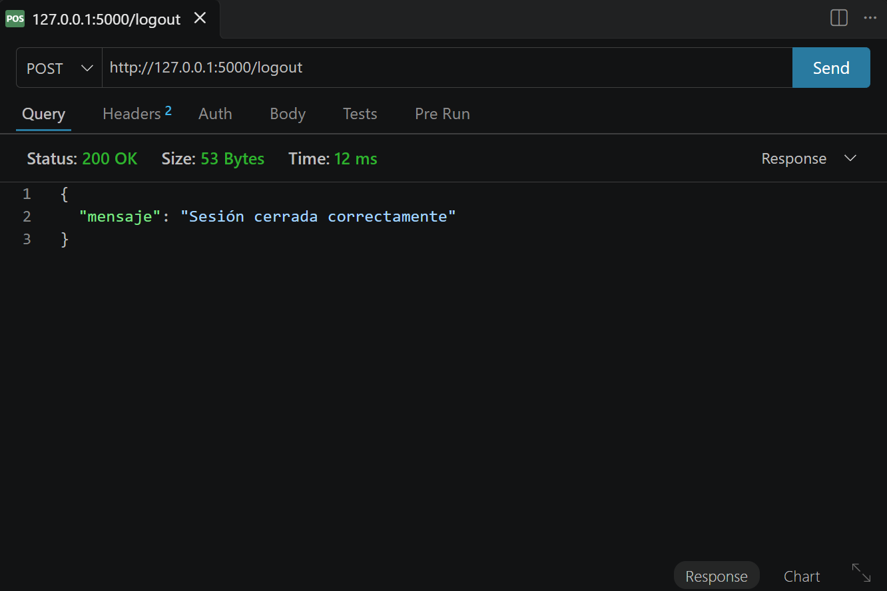
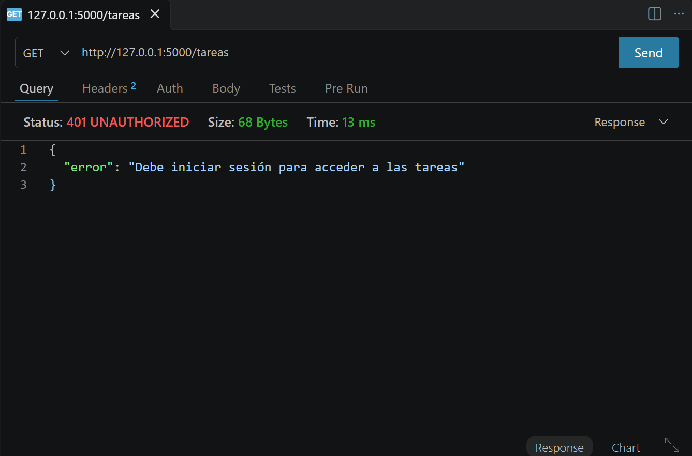

# PFO 2 - Sistema de Gestión de Tareas con API y Base de Datos

## Descripción

Este proyecto corresponde al **PFO 2: Sistema de Gestión de Tareas con API y Base de Datos**.

El objetivo es implementar una API REST utilizando **Flask**, persistencia de datos mediante **SQLite** y un sistema básico de autenticación de usuarios con contraseñas almacenadas de forma segura mediante hashing.

El proyecto también incluye un cliente de consola desarrollado en Python que permite interactuar con los distintos endpoints de la API.

## Tecnologías utilizadas

- Python
- Flask
- SQLite
- Werkzeug
- Requests
- python-dotenv

## Estructura del proyecto

```text
PFO2_Gestion_Tareas/
│
├── servidor.py
├── cliente.py
├── requirements.txt
├── .env.example
├── .gitignore
└── README.md
```

Los archivos `.env`, `tareas.db` y la carpeta `venv/` no se incluyen en el repositorio.

## Funcionalidades

El sistema permite:

- Registrar nuevos usuarios.
- Almacenar las contraseñas utilizando hashing.
- Iniciar sesión mediante usuario y contraseña.
- Mantener la autenticación mediante sesiones.
- Acceder a una ruta protegida `/tareas`.
- Mostrar una página HTML de bienvenida.
- Cerrar la sesión del usuario.
- Interactuar con la API mediante un cliente de consola.
- Persistir los usuarios registrados mediante SQLite.

## Instalación

### 1. Clonar el repositorio

```bash
git clone URL_DEL_REPOSITORIO
```

Ingresar a la carpeta del proyecto:

```bash
cd PFO2_Gestion_Tareas
```

### 2. Crear un entorno virtual

```bash
python -m venv venv
```

En Windows, activarlo mediante:

```bash
venv\Scripts\activate
```

### 3. Instalar las dependencias

```bash
pip install -r requirements.txt
```

## Configuración de variables de entorno

El proyecto utiliza una variable de entorno para almacenar la clave secreta utilizada por Flask para las sesiones.

Crear un archivo llamado `.env` en la raíz del proyecto tomando como referencia `.env.example`.

Ejemplo:

```text
SECRET_KEY=colocar_aqui_una_clave_secreta
```

El archivo `.env` está incluido en `.gitignore`, por lo que la clave secreta utilizada localmente no se publica en el repositorio.

## Ejecución del servidor

Ejecutar:

```bash
python servidor.py
```

El servidor Flask estará disponible por defecto en:

```text
http://127.0.0.1:5000
```

Al ejecutarse por primera vez, el sistema crea automáticamente la base de datos SQLite `tareas.db` y la tabla necesaria para almacenar los usuarios.

## Endpoints

### POST /registro

Permite registrar un nuevo usuario.

Ejemplo del cuerpo de la petición:

```json
{
    "usuario": "maria",
    "contraseña": "1234"
}
```

La contraseña no se almacena en texto plano. Antes de almacenarse en SQLite se genera un hash utilizando las herramientas de seguridad proporcionadas por Werkzeug.

### POST /login

Permite iniciar sesión utilizando las credenciales de un usuario previamente registrado.

Ejemplo:

```json
{
    "usuario": "maria",
    "contraseña": "1234"
}
```

Si las credenciales son correctas, el servidor crea una sesión para el usuario.

### GET /tareas

Ruta protegida que solamente puede ser utilizada por un usuario que haya iniciado sesión.

Si existe una sesión válida, devuelve una página HTML de bienvenida.

Si el usuario no inició sesión, el servidor responde con un error `401 Unauthorized`.

### POST /logout

Finaliza la sesión actual del usuario.

Después de cerrar sesión, el usuario deberá volver a autenticarse para acceder a `/tareas`.

## Cliente de consola

El proyecto incluye `cliente.py`, que permite interactuar con la API desde una terminal.

Antes de ejecutar el cliente, el servidor Flask debe encontrarse funcionando.

En una terminal:

```bash
python servidor.py
```

En una segunda terminal:

```bash
python cliente.py
```

El cliente presenta el siguiente menú:

```text
==============================
   SISTEMA DE GESTIÓN
==============================
1. Registrar usuario
2. Iniciar sesión
3. Ver tareas
4. Cerrar sesión
5. Salir
```

El cliente utiliza `requests.Session()` para conservar la cookie de sesión enviada por Flask entre las distintas peticiones.

## Pruebas

La API puede probarse utilizando el cliente de consola incluido en el proyecto o herramientas para realizar peticiones HTTP, como **Thunder Client**.

Un flujo de prueba posible es:

1. Registrar un usuario mediante `POST /registro`.
2. Intentar acceder a `GET /tareas` sin iniciar sesión y comprobar la respuesta `401`.
3. Iniciar sesión mediante `POST /login`.
4. Acceder nuevamente a `GET /tareas` y comprobar que se obtiene el HTML de bienvenida.
5. Cerrar la sesión mediante `POST /logout`.
6. Intentar acceder nuevamente a `/tareas` y comprobar que el acceso vuelve a ser rechazado.

## Seguridad

El proyecto implementa algunas prácticas básicas de seguridad:

- Las contraseñas no se almacenan en texto plano.
- Se utiliza hashing para proteger las contraseñas.
- Las consultas SQL utilizan parámetros en lugar de concatenación directa.
- La clave secreta de Flask se almacena mediante una variable de entorno.
- El archivo `.env` no se almacena en el repositorio.
- El acceso a `/tareas` requiere una sesión válida.

## Persistencia

La información de los usuarios se almacena utilizando **SQLite**.

La base de datos se genera localmente y no se incluye en el repositorio debido a que puede contener información correspondiente a los usuarios registrados.

# Capturas de pruebas

A continuación se muestran algunas pruebas realizadas sobre los endpoints de la API utilizando Thunder Client.

## Registro de usuario

Petición `POST /registro` realizada correctamente:



## Inicio de sesión

Petición `POST /login` con credenciales válidas:



## Acceso a tareas

Petición `GET /tareas` realizada luego de iniciar sesión:



## Cierre de sesión

Petición `POST /logout` para finalizar la sesión del usuario:



## Acceso denegado después de cerrar sesión

Luego de cerrar la sesión, se intenta acceder nuevamente a `GET /tareas`.

El servidor rechaza correctamente la solicitud con el código de estado `401 Unauthorized`, demostrando que la ruta se encuentra protegida y requiere una sesión activa.



Trabajo realizado para **PFO 2 - Sistema de Gestión de Tareas con API y Base de Datos**.